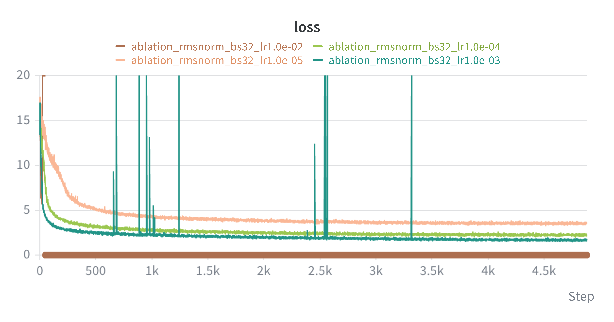

# ablations

## rmsnorm ablations

the loss function went to moon when learning rate was 1e-3.

as you can see, as the learning rate decrease, the loss decreased slower (expected). with 1e-4, we didn't see any of the spikes as in 1e-3.

the impact of rmsnorm: stability. without rmsnorm, we saw huge spikes where the loss exploded. this can be however mitigated by a smaller learning rate.

put another way, rmsnorm allowd us to use bigger learning rates for faster training.

claude says: rmsnorm makes training robust to the learning rate.