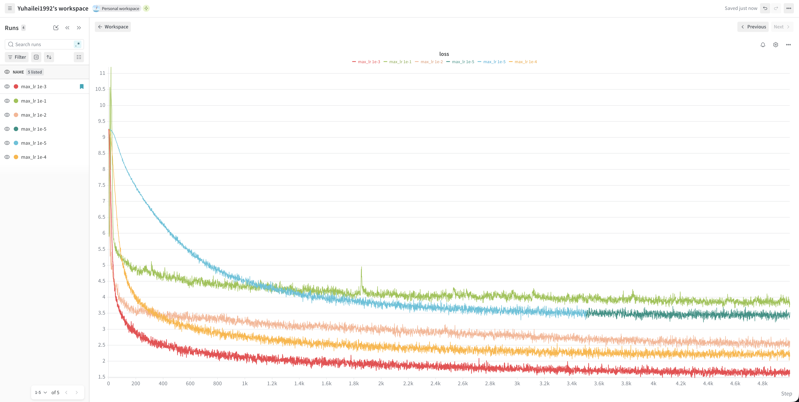
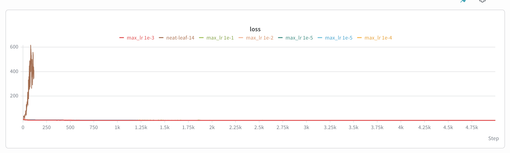

# learning rate experiments

the graph:

as you can see, the 1e-3 learning rate is optimal, among the 1e-1, 1e-2, 1e-3, 1e-4, and 1e-5 sweep.

below is a divergent run. max_lr is 1. the loss went to the moon.

